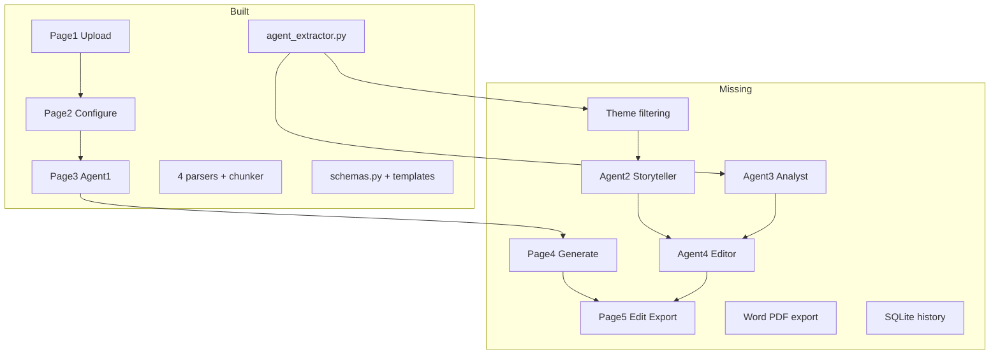

# CaseGen — Full End-to-End Build Plan

## Current state (~35% complete)




**Root cause of Agent 1 "failure":** saved `[session_backup/master_transcript.md](session_backup/master_transcript.md)` contains only the Tata Steel homepage URL (nav menus, cookie banners) — not an annual report PDF. Agent 1 cannot extract company/revenue from that input. The pipeline architecture is sound; ingest quality and missing downstream agents are the blockers.

---

## Target architecture (matches [Project_Plan_Ananshi.md](Project_Plan_Ananshi.md))

```mermaid
flowchart LR
    Upload[Page1: PDF Audio Excel URL] --> Merge[master_transcript dict]
    Merge --> Config[Page2: ui_config]
    Config --> Chunk[text_chunker]
    Chunk --> Agent1[Agent1 FactSheet + themes]
    Agent1 --> Angle[Page3: pick theme]
    Angle --> Filter[filter_fact_sheet by theme]
    Filter --> Gen[Page4: Agent2 + Agent3 parallel]
    Gen --> Agent4[Agent4 merge verify cite]
    Agent4 --> Edit[Page5: edit + export]
```




---

## Workstream 1 — Fix ingest (all 4 input types)

### 1A. Restructure master transcript

**File:** `[pages/1_Upload_Documents.py](pages/1_Upload_Documents.py)`

Change `master_transcript` from a flat string to a **dict keyed by source name** as specified in the plan:

```python
st.session_state["master_transcript"] = {
    "Tata_Steel_AR_2025.pdf": "...markdown...",
    "CFO_Interview.mp3": "...transcript...",
}
```

Add a helper `[pipeline/ingest/merge_sources.py](pipeline/ingest/merge_sources.py)` with `merge_to_text(dict) -> str` for chunking and `save_backup(dict)` for JSON persistence.

Update `[pipeline/ingest/text_chunker.py](pipeline/ingest/text_chunker.py)` — dict path already exists; make it the primary path.

### 1B. PDF parser fixes

**File:** `[pipeline/ingest/docling_parser.py](pipeline/ingest/docling_parser.py)`

- Fix bug: pass `page_range` to `converter.convert(**convert_kwargs)` (currently ignored).
- Add `os.makedirs("session_backup")` before writes on Page 1.
- Wrap conversion in try/except with user-friendly errors (corrupted/password PDF).
- Add optional `max_pages` dev toggle in Page 1 sidebar for testing.
- Prefix each page block with `<!-- page N -->` in exported markdown for IFQM citations.

### 1C. Web parser upgrade

**File:** `[pipeline/ingest/web_parser.py](pipeline/ingest/web_parser.py)`

- Prefer `<main>`, `<article>`, `[role=main]` before falling back to body text.
- Detect homepage-style junk (high nav-link density, short paragraphs) and return a warning string the UI can surface.
- Support direct PDF URLs via `requests` + Docling (many annual reports are linked as `.pdf`).

### 1D. Audio parser upgrade

**File:** `[pipeline/ingest/whisper_audio.py](pipeline/ingest/whisper_audio.py)`

- Cache Whisper model in module-level singleton (load once per session).
- Add model size param (`tiny`/`base`/`medium`) from Page 1 sidebar or `[config.py](config.py)`.
- Return transcript with `[Speaker unknown]` segments; optional future: `whisper` word timestamps.

### 1E. Spreadsheet parser

**File:** `[pipeline/ingest/spreadsheet_parser.py](pipeline/ingest/spreadsheet_parser.py)` — already works. Add row cap (e.g. 500 rows) and sheet-name header for multi-sheet Excel.

### 1F. Page 1 UX guards

**File:** `[pages/1_Upload_Documents.py](pages/1_Upload_Documents.py)`

- Per-file status indicators (success/error + char count).
- Block "Next" if extract not run or transcript total chars < 500.
- Show quality warning if content looks like homepage junk.
- Create `session_backup/` before first write.

---

## Workstream 2 — Fix Agent 1 reliability

**File:** `[pipeline/agents/agent_extractor.py](pipeline/agents/agent_extractor.py)`

### 2A. Empty-input detection

After Pass 1, if `non_empty == 0`, raise a clear error: *"No facts extracted — check that you uploaded a PDF annual report, not a homepage URL."*

### 2B. Real Pydantic retry loop (per plan)

On `ValidationError`, re-prompt Gemini with the error message appended (up to 3 attempts) — not just Python fallbacks.

### 2C. Schema alignment

**File:** `[pipeline/models/schemas.py](pipeline/models/schemas.py)`

- Make `KeyQuote.source` `Optional[str] = None` (prompt allows null).
- Add optional `theme_tags: List[str]` on fact items OR a `TaggedFact` model for theme filtering (see Workstream 3).

### 2D. Progress callback

Add optional `on_progress(batch_num, total_batches)` param to `run_agent_1()` so Page 3 progress bar updates per batch (currently stuck at 10%).

### 2E. Shared LLM client

Create `[pipeline/agents/llm_client.py](pipeline/agents/llm_client.py)`:

- Centralize `google.genai` (migrate off deprecated `google.generativeai`).
- Shared `_extract_json()`, retry with exponential backoff, temperature from `[config.py](config.py)`.

---

## Workstream 3 — Theme filtering

**File:** new `[pipeline/agents/theme_filter.py](pipeline/agents/theme_filter.py)`

When user selects theme on Page 3, call Gemini with:

> "Given this FactSheet and selected theme X, return a filtered FactSheet JSON keeping only facts relevant to theme X. Keep company_name and all key_quotes that support the theme."

Store in `st.session_state["filtered_fact_sheet"]`.

Update `[pages/3_Select_Angle.py](pages/3_Select_Angle.py)` line 208 — replace `filtered_fact_sheet = fact_sheet` with actual filter call on "Generate Case Study" click.

---

## Workstream 4 — Build Agents 2, 3, 4

### 4A. Agent 2 — Storyteller

**New file:** `[pipeline/agents/agent_storyteller.py](pipeline/agents/agent_storyteller.py)`

**Inputs:** `filtered_fact_sheet`, `ui_config`, `[templates/case_template.json](templates/case_template.json)`, `[templates/few_shot_examples.json](templates/few_shot_examples.json)`

**Output:** Markdown dict keyed by section id (`background`, `industry_context`, `challenge`, `intervention`, `results`, `learnings`)

**Prompt rules:** third-person past tense; use FactSheet only; weave `key_quotes`; respect word limits from template; apply tone/audience/discipline from `ui_config`.

**Also implement:** `regenerate_section(section_id, ...)` for Page 5.

### 4B. Agent 3 — Analyst

**New file:** `[pipeline/agents/agent_analyst.py](pipeline/agents/agent_analyst.py)`

**Inputs:** `filtered_fact_sheet`, `ui_config.audience`, `[config.py](config.py)` `EXHIBITS_CONFIG`

**Output:**

- `exhibits`: Markdown tables (financial comparison, timeline, KPI before/after) — skip if no numeric data
- `discussion_questions`: 3 (undergrad) or 5 (MBA/C-suite) open-ended questions

### 4C. Agent 4 — Editor & Verifier

**New file:** `[pipeline/agents/agent_editor.py](pipeline/agents/agent_editor.py)`

**Sequential operations:**

1. Merge Agent 2 sections + Agent 3 exhibits/questions into ordered Markdown
2. Fact-check pass: flag sentences with numbers/dates not in original (unfiltered) `fact_sheet`; rewrite or remove
3. Bias detection: neutralize unsupported superlatives
4. Privacy masking if `ui_config.data_privacy == True`: replace absolute figures with directional language
5. Citation engine: build References section from source keys in `master_transcript` dict + citation format from `ui_config`

**Output:** `final_markdown` string

### 4D. Parallel runner

**New file:** `[pipeline/agents/run_generation.py](pipeline/agents/run_generation.py)`

Use `concurrent.futures.ThreadPoolExecutor` to run Agent 2 and Agent 3 in parallel, then Agent 4 sequentially. Expose progress callbacks for Page 4 UI.

---

## Workstream 5 — Build Pages 4 and 5

### 5A. Page 4 — Generate

**New file:** `[pages/4_Generate_Case_Study.py](pages/4_Generate_Case_Study.py)`

- Guard: require `filtered_fact_sheet`, `ui_config`, `chunks`
- Dual progress indicators for Agent 2 and Agent 3
- Auto-run generation on first load (mirror Page 3 Agent 1 pattern)
- Store `narrative`, `exhibits`, `discussion_questions` in session state
- Back → Page 3; Next → Page 5

### 5B. Page 5 — Edit & Export

**New file:** `[pages/5_Edit_Export.py](pages/5_Edit_Export.py)`

- Run Agent 4 on first load if `final_markdown` not cached
- Large `st.text_area` for manual edits
- Per-section "Regenerate" buttons calling `regenerate_section()` then re-running Agent 4 merge
- Download buttons: Word (.docx) and PDF

**New file:** `[pipeline/export/markdown_to_docx.py](pipeline/export/markdown_to_docx.py)` — python-docx: headings, bold, pipe tables

**New file:** `[pipeline/export/markdown_to_pdf.py](pipeline/export/markdown_to_pdf.py)` — markdown → HTML → WeasyPrint

Style: Times New Roman 12pt, 1-inch margins (IFQM defaults in export module).

---

## Workstream 6 — Session persistence & history

**New file:** `[pipeline/persistence/session_store.py](pipeline/persistence/session_store.py)`

- After Agent 1: save `output/fact_sheet_{timestamp}.json`
- After Agent 4: save `output/case_{timestamp}.md`
- On app load (`[app.py](app.py)`): check for recent session files; offer "Restore last session"

**New file:** `[pipeline/persistence/case_history.py](pipeline/persistence/case_history.py)`

- SQLite `case_history.db`: id, company_name, theme, created_at, markdown_path
- Optional sidebar page `[pages/6_My_Case_Studies.py](pages/6_My_Case_Studies.py)` to list and reload past cases

---

## Workstream 7 — Project hygiene

**New file:** `[requirements.txt](requirements.txt)` — pin: streamlit, docling, pandas, langchain-text-splitters, google-genai, pydantic, python-docx, weasyprint, openai-whisper, beautifulsoup4, requests, python-dotenv, tabulate (for `df.to_markdown`)

**Update:** `[config.py](config.py)` — add `WHISPER_MODEL`, `GEMINI_MODEL`, chunk defaults

---

## Implementation order (parallel workstreams, suggested merge sequence)


| Step | Deliverable                             | Unblocks                |
| ---- | --------------------------------------- | ----------------------- |
| 1    | `llm_client.py` + schema fixes          | All agents              |
| 2    | Ingest fixes (1A–1F)                    | Reliable Agent 1 input  |
| 3    | Agent 1 fixes (2A–2E) + Page 3 progress | Trustworthy FactSheet   |
| 4    | `theme_filter.py` + Page 3 update       | Focused narrative       |
| 5    | Agents 2 + 3 + `run_generation.py`      | Core writing            |
| 6    | Page 4                                  | User sees generation    |
| 7    | Agent 4 + export modules                | Fact-checked output     |
| 8    | Page 5                                  | Downloadable case study |
| 9    | Persistence + history                   | Survive refresh         |


---

## End-to-end test plan (acceptance criteria)

Use **Tata Steel Integrated Report PDF** (not homepage URL) plus optional CFO interview MP3 and one Excel financial sheet:

1. Page 1: Extract all sources → preview shows chairman message, revenue figures, tables
2. Page 2: Configure MBA audience, IFQM purpose, APA citations
3. Page 3: Agent 1 populates company name, revenue, 3–5 themes; user picks one
4. Page 4: Agents 2+3 complete; narrative + exhibits visible
5. Page 5: Agent 4 produces full Markdown with References; Word/PDF download works
6. Refresh browser → session restore offers to reload last case

**Success metric:** Downloaded .docx contains Background, Challenge, Intervention, Results, Exhibits, Discussion Questions, and References — with no fabricated revenue figures not present in the uploaded PDF.

---

## Key files to create (13 new)


| File                                    | Purpose                                     |
| --------------------------------------- | ------------------------------------------- |
| `pipeline/agents/llm_client.py`         | Shared Gemini client + JSON extract + retry |
| `pipeline/agents/theme_filter.py`       | Filter FactSheet by selected theme          |
| `pipeline/agents/agent_storyteller.py`  | Agent 2                                     |
| `pipeline/agents/agent_analyst.py`      | Agent 3                                     |
| `pipeline/agents/agent_editor.py`       | Agent 4                                     |
| `pipeline/agents/run_generation.py`     | Parallel orchestration                      |
| `pipeline/ingest/merge_sources.py`      | Dict-based transcript merge                 |
| `pipeline/export/markdown_to_docx.py`   | Word export                                 |
| `pipeline/export/markdown_to_pdf.py`    | PDF export                                  |
| `pipeline/persistence/session_store.py` | JSON backup + restore                       |
| `pipeline/persistence/case_history.py`  | SQLite history                              |
| `pages/4_Generate_Case_Study.py`        | Generation page                             |
| `pages/5_Edit_Export.py`                | Edit + download page                        |


## Key files to modify (8 existing)

`[pages/1_Upload_Documents.py](pages/1_Upload_Documents.py)`, `[pages/2_Configure_Case_Study.py](pages/2_Configure_Case_Study.py)`, `[pages/3_Select_Angle.py](pages/3_Select_Angle.py)`, `[pipeline/agents/agent_extractor.py](pipeline/agents/agent_extractor.py)`, `[pipeline/ingest/docling_parser.py](pipeline/ingest/docling_parser.py)`, `[pipeline/ingest/web_parser.py](pipeline/ingest/web_parser.py)`, `[pipeline/ingest/whisper_audio.py](pipeline/ingest/whisper_audio.py)`, `[pipeline/models/schemas.py](pipeline/models/schemas.py)`